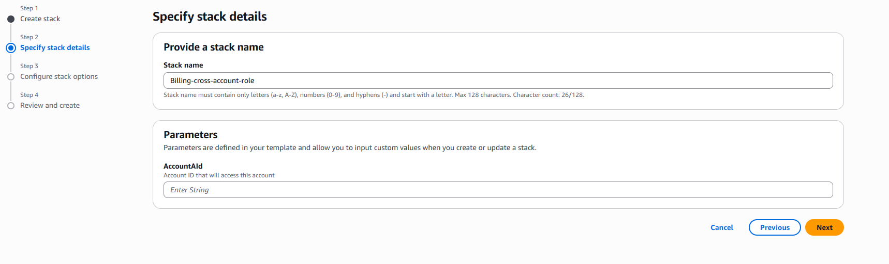
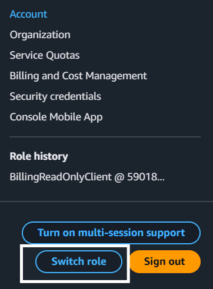

# AWS Cross-Account Billing Read-Only Access

This guide explains how to grant **billing read-only access** from one AWS account to another using **IAM Roles** and **CloudFormation**.

This approach avoids creating IAM users in the client account and follows AWS security best practices.

---

## 🏗 Architecture

Source Account → Assume Role → Target / Client Account → Billing Read-Only Access

---

## 📘 Account Definitions

| Term | Description |
|------|-------------|
| Account A | Source account (where you log in from) |
| Account B | Target / client account (where billing exists) |

---

## 🚀 Step 1 — Login to Client Account (Account B)

Login to the **client / target account**.

Go to:

Billing → Account settings

Enable:

IAM user/role access to billing → ON

This step is mandatory.

---

## 🚀 Step 2 — Create CloudFormation Stack

Go to:

CloudFormation → Create stack → Upload template

Upload the template from:

cross-account-billing/template/billing-role.yaml

---

## 🚀 Step 3 — Provide Stack Details

Enter a stack name and the **AccountAId parameter**.

⚠️ **Important**

Enter the **Account ID from which you will access the client account**  
(this is the source / login account).

Do **NOT** enter the client account ID.

### Example

Account A (source / login): 891377084904
Account B (client): 590184024210

Parameter value:

AccountAId = 891377084904

Click **Create Stack** and wait until:

CREATE_COMPLETE

---

## 🚀 Step 4 — Switch Role from Source Account

Login to **Account A** (source account).

Click the account name in the top-right corner and select **Switch Role**.

---

## 🚀 Step 5 — Enter Role Details

Provide the following details:

| Field | Value |
|------|------|
| Account ID | Client account ID (Account B) |
| Role name | BillingReadOnlyClient |
| Display name | Optional |

Example:

Account ID: 590184024210
Role name: BillingReadOnlyClient

Click **Switch Role**.

---

## ✅ Step 6 — Verify Access

You are now logged into the **client account** using a billing read-only role.

Open:

Billing → Cost Management

You should be able to **view billing information only** (no edit access).

---

## 🔐 Security Model Explained

Two permission layers are involved:

1. **Trust Policy**
   - Allows Account A to assume a role in Account B

2. **Permission Policy**
   - Grants billing read-only access after assuming the role

---

## 🧠 Key Rule to Remember

Deploy stack in → Target / Client account (Account B)
Enter AccountAId → Source / Login account (Account A)
Switch role from → Source account

---

## 📂 Repository Structure

cross-account-billing/
├─ README.md
├─ template/
│ └─ billing-role.yaml
└─ images/
├─ Cloudformation-stack-1.png
├─ Cloudformation-stack-2.png
├─ Cloudformation-stack-3.png
└─ Cloudformation-stack-4.png

---

## 👨‍💻 Author

Tanmay  
DevOps Engineer
